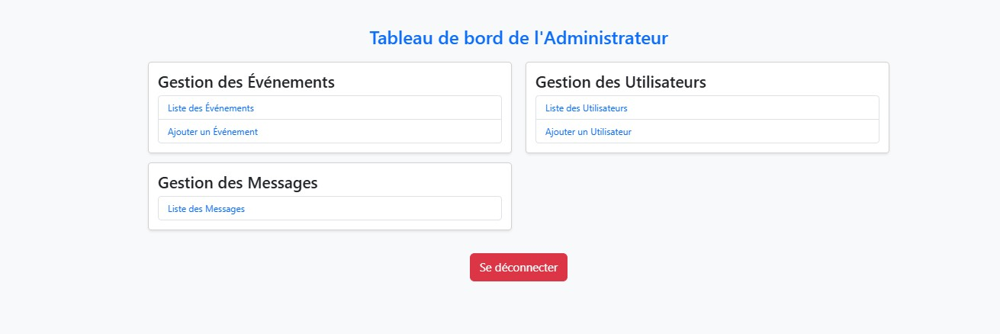
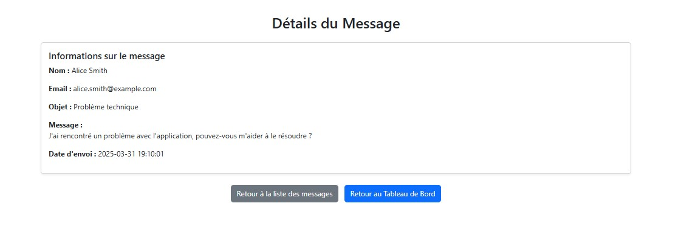
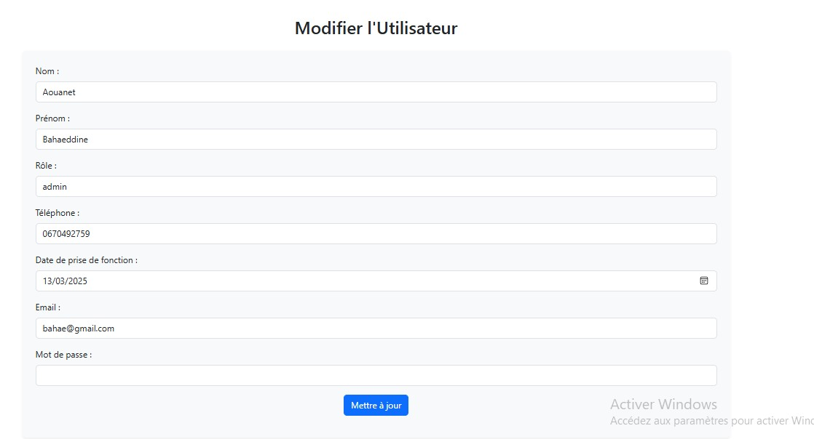
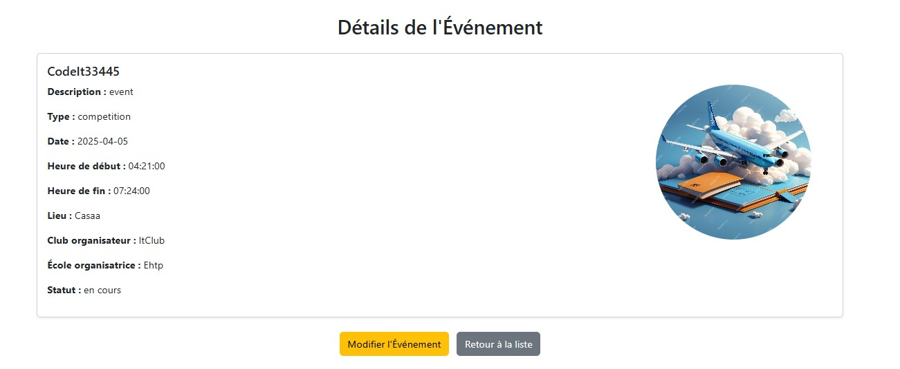
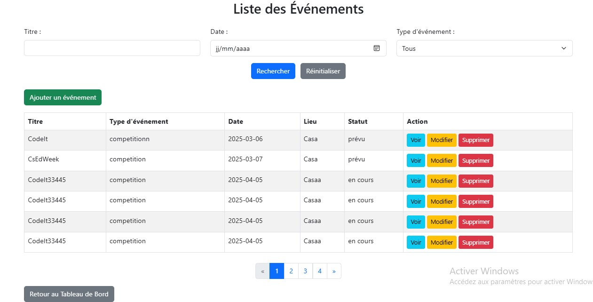
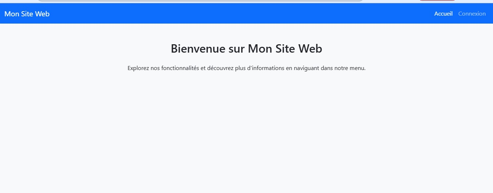
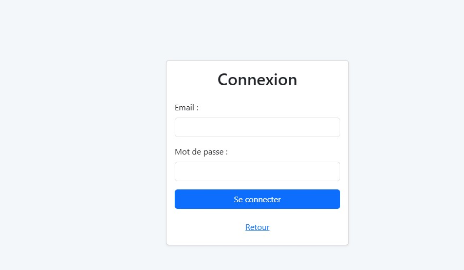
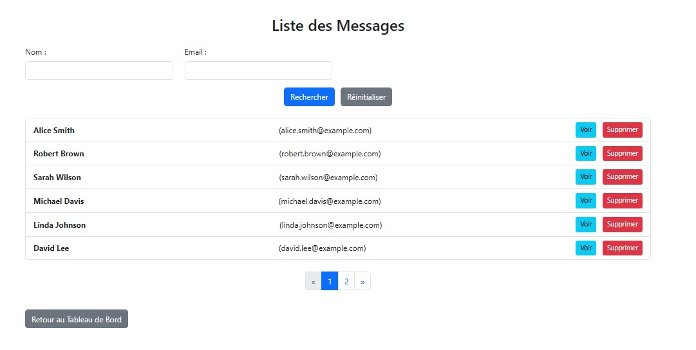
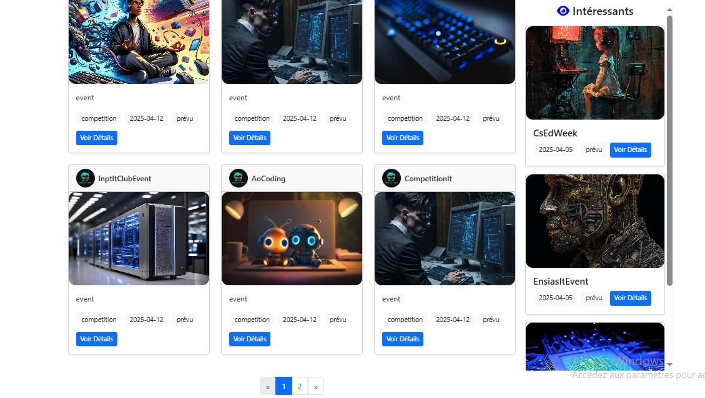
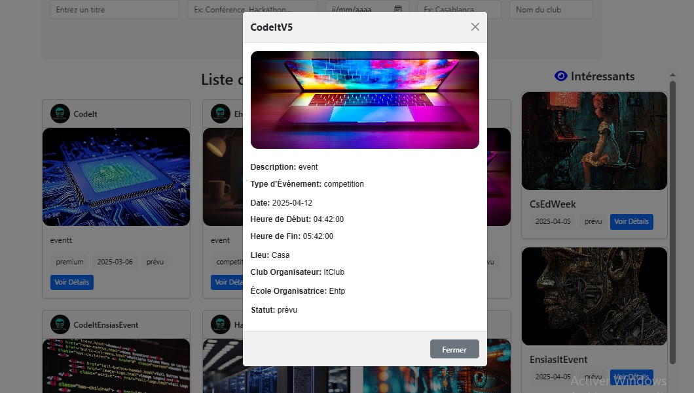

# HassaniaItClubProject

Ce projet est une plateforme de gestion des utilisateurs, des événements et des messages des visiteurs du site du **Hassania IT Club** de l'École Hassania des Travaux Publics.  
L'application permet aux administrateurs de gérer les membres du club, organiser des événements et répondre aux messages des visiteurs.  

## Aperçu des interfaces  

### 1. Dashboard (Page d'accueil de l'administration)  
  
Cette page offre un aperçu global du système avec des statistiques sur les utilisateurs, les événements et les messages.  
Elle permet aux administrateurs d’accéder rapidement aux fonctionnalités principales.  

### 2. Page de détails d’un message  
  
Cette page affiche le contenu d'un message envoyé par un visiteur du site.  
L'administrateur peut voir l’expéditeur, la date et le message en détail.  

### 3. Modification d’un événement  
  
Permet à l'administrateur de modifier les informations d'un événement existant,  
telles que le titre, la date, la description et l’image associée.  

### 4. Gestion des utilisateurs  
  
Sur cette page, l'administrateur peut modifier les informations des utilisateurs, leur rôle et leurs permissions.  
Elle assure un contrôle total sur les membres du club.  

### 5. Détails d’un événement  
  
Affiche les informations complètes sur un événement donné,  
y compris les participants inscrits et les détails de l’organisation.  

### 6. Liste des événements  
  
Page qui répertorie tous les événements passés et à venir.  
L’administrateur peut ajouter, modifier ou supprimer des événements.  

### 7. Page d'accueil publique  
  
Il s'agit de la page principale du site visible par tous les visiteurs.  
Elle met en avant les événements en cours et des informations sur le club.  

### 8. Page de connexion  
  
Permet aux administrateurs et membres autorisés de se connecter au système  
pour accéder aux fonctionnalités de gestion.  

### 9. Gestion des messages  
  
Cette section permet aux administrateurs de consulter, répondre et gérer  
les messages envoyés par les visiteurs du site.  

### 10. Liste des utilisateurs  
  
Affiche tous les membres du club et leurs informations associées.  
L’administrateur peut ajouter, modifier ou supprimer des utilisateurs.  

### 11. Interfaces evenements 
 

  

---

🎯 **À propos du projet :**  
Ce projet a été développé pour faciliter la gestion des activités du **Hassania IT Club**  
et optimiser l’organisation des événements et la communication avec les visiteurs.  

💡 **Fonctionnalités principales :**  
- Gestion des utilisateurs (ajout, modification, suppression, rôles)  
- Organisation des événements (création, modification, suppression)  
- Gestion des messages envoyés par les visiteurs  
- Authentification sécurisée pour les administrateurs  

🚀 **Technologies utilisées :**  
- Frontend : *(ex. React, Vue.js, Bootstrap… à préciser selon ton projet)*  
- Backend : *(ex. Node.js, Django, Laravel… à préciser selon ton projet)*  
- Base de données : *(ex. MySQL, MongoDB… à préciser selon ton projet)*  

📌 **Installation et utilisation :**  
1. **Cloner le projet**  
   ```sh
   git clone https://github.com/ton-repo/hassania-it-club.git
   cd hassania-it-club
